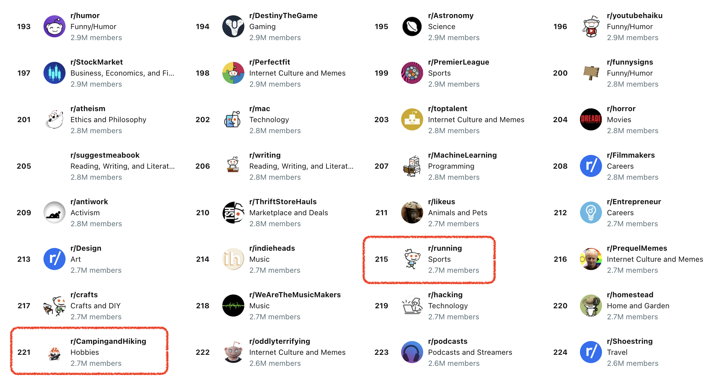

# Problem Statement
ย้อนกลับไปในช่วงของ โควิด-19 พฤติกรรมของผู้คนถูกปรับเปลี่ยน ถูกควบคุมและจำกัดการเดินทาง และกิจกรรม
แต่เมื่อเหตุการ์ณคลีคลายลงเราจะพบว่า มีหลายๆกิจกรรม หลายๆ Event เกิดขึ้นมากมาย และมาพร้อมกับการออกเดินทางของผู้คนอีกครั้งหนึ่ง

นั้นจึงเป็นคำถามหลักของการค้นคว้านี้ อะไรคือกิจกรรมนอกสถานที่ที่มีการพูดถึงมากที่สุด เพื่อน่ำข้อมูลเหล่านั้นมาวิเคราะห์ และสร้างสินค้า, สร้างสื่อ และสร้างการรู้จักตัวสินค้าของเราผ่านกิจกรรมเหล่านั้น

เงื่อนไขในการค้นหว้า
  1. เป็นกิจกรรมนอกสถานที่ ที่สามารถจัดขึ้นได้บ่อยๆ หรือออกไปทำกิจกรรมได้ทุกวัปดาห์
  2. เป็นที่พูดในถึงใน www.reddit.com ช่วงเวลาตั้งแต่หลังโควิด - 19
  3. ไม่ซ้ำซ้อนกับกิจกรรมที่ได้รับความนิยมอยู่แล้วในปัจจุบัน (Red Ocean)

จากเงื่อนไขในด้านบน community ที่ถูกเลือกมาคือ Community: running, Community: Camping & Hiking

# Datasets

Scraping data from the top 2000 posts from the two subreddits:
1. [r/running](https://www.reddit.com/r/running/)
2. [r/Camping&Hiking](https://www.reddit.com/r/Camping&Hiking/)

to train models.

# Data Cleaning
